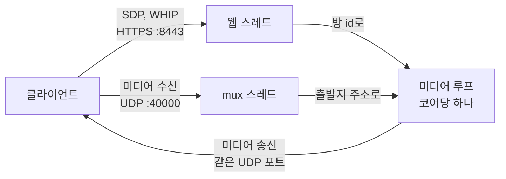

# Stream

[](https://github.com/kimsun721/stream/actions/workflows/ci.yml)

[English](README.md) | 한국어

Rust와 [str0m](https://github.com/algesten/str0m)으로 만든 라이브 스트리밍용 WebRTC SFU입니다. 송출자는 OBS나 브라우저에서 WHIP으로 방송을 올립니다. 시청자는 대역폭 추정치에 맞는 simulcast 레이어를 받고, 업로드 여유가 있는 시청자는 다른 시청자에게 P2P로 스트림을 중계해 서버 부하를 덜어줍니다.

<!-- demo GIF -->

## 측정 결과

한 머신에서 루프백으로 측정했고, 부하 생성기도 같은 머신에서 돌렸습니다(AMD Ryzen 7 8845HS, 16스레드). 송출자는 simulcast 레이어 3개를 보냅니다.

| | |
| --- | --- |
| 미디어 루프 1개 | 시청자 약 400명에서 포화, 코어 1개 사용 |
| 미디어 루프 4개 | 방 4개에 시청자 1600명, 패킷 손실 없음 |
| P2P relay | 미디어 바이트의 46~50%를 시청자가 대신 전달. relay 하나가 시청자 하나를 맡으므로 절반이 상한 |

각 측정과 그 측정으로 배제한 가설은 [docs/test/baseline](docs/test/baseline/)에 기록되어 있습니다.

## 빠른 시작

```sh
cp .env.example .env            # API_KEY 설정, 16자 이상
cp config.toml.example config.toml
cargo run --release
```

방을 만듭니다.

```sh
curl -X POST http://localhost:8080/rooms -H "Authorization: Bearer <API_KEY>"
# {"room_id":"RM_0_...","stream_key":"SK_..."}
```

OBS 30 이상에서 설정, 방송으로 들어가 서비스를 `WHIP`, 서버를 `http://localhost:8443/whip`, Bearer 토큰을 받은 `stream_key`로 설정하고 방송을 시작합니다. 이제 방은 `Preview` 상태입니다. 미디어는 들어오지만 아직 시청자에게 나가지 않습니다.

방송을 시작합니다.

```sh
curl -X PATCH http://localhost:8080/rooms/<room_id> \
  -H "Authorization: Bearer <API_KEY>" \
  -H "Content-Type: application/json" \
  -d '{"state":"Live"}'
```

이제 시청자가 `/offer`로 SDP offer를 보내 입장할 수 있습니다.

<!-- viewer page -->

`config.toml`의 모든 항목에는 기본값이 있어서 파일이 없어도 됩니다. 비밀값은 `.env`의 하나뿐이고, 나머지는 모두 설정 파일에 있습니다.

서버는 처음 찾은 네트워크 인터페이스 주소로 미디어를 보내라고 클라이언트에게 알립니다. NAT 뒤에서는 `server.public_ip`를 클라이언트가 닿을 수 있는 주소로 설정해야 합니다.

`docker compose up`으로도 같은 서버를 띄울 수 있습니다. 이때는 `compose.yaml`에서 `config.toml` 볼륨 줄의 주석을 풀어야 설정 파일을 읽고, `server.public_ip`도 설정해야 합니다. 컨테이너 안에서 처음 찾는 인터페이스는 브리지라 외부에서 닿지 않습니다.

`[server.tls]`를 설정하면 `:8443`이 TLS로 동작합니다. `:8080`은 항상 평문 HTTP이며 사설망에만 두어야 합니다. 이 섹션이 없으면 둘 다 평문이며, 리버스 프록시 뒤에 두는 배포를 위한 설정입니다.

## 구조



시그널링은 HTTPS로 웹 스레드에 들어오고, 웹 스레드는 각 클라이언트를 그 방을 맡은 미디어 루프에 넘깁니다. 미디어는 UDP 포트 하나로 들어오며, mux 스레드가 읽어서 출발지 주소의 주인인 루프에 넘깁니다. 각 루프는 자기 방들을 혼자 소유한 채 자기 스레드에서 돌고, 같은 포트로 내보내므로 클라이언트에게는 주소 하나로 보입니다.

전체 흐름은 [docs/architecture](docs/architecture/overview.md)에 있습니다.

## 인증

포트별로 자격 증명이 두 가지입니다.

| 자격 증명 | 헤더 | 사용하는 쪽 | 범위 |
| --- | --- | --- | --- |
| 서버 API 키 | `Authorization: Bearer <API_KEY>` | 백엔드 | 모든 제어 경로 |
| 스트림 키 | `Authorization: Bearer <SK_...>` | 송출자 | 방 하나 |

서버 API 키는 환경 변수에서 읽으며 브라우저에 절대 노출되면 안 됩니다. 스트림 키는 방마다 발급되고, 발급 시 한 번만 반환되며, 해시로만 저장됩니다. 송출 권한 확인과 방 선택을 함께 하므로 송출 URL에 방 id가 드러나지 않습니다. [ADR 0010](docs/decisions/0010-stream-key-authentication.md) 참고.

## 제어 API

HTTP `:8080`, 백엔드 전용입니다. 모든 경로에 서버 API 키가 필요합니다.

| 메서드 | 경로 | 설명 |
| --- | --- | --- |
| `POST` | `/rooms` | 방 생성. `room_id`와 `stream_key` 반환 |
| `GET` | `/rooms/{id}` | 시청자 수와 방 상태 |
| `PATCH` | `/rooms/{id}` | 방 상태 변경. `Idle`은 방송 종료도 겸함 |
| `DELETE` | `/rooms/{id}` | 방과 스트림 키 삭제 |
| `POST` | `/rooms/{id}/stream-key` | 스트림 키 재발급. 이전 키는 폐기 |
| `GET` | `/metrics.json` | 미디어 루프의 카운터와 소요 시간. 시작 후 누적값 |

## 클라이언트 API

HTTPS `:8443`, 클라이언트가 직접 호출합니다.

| 메서드 | 경로 | 인증 | 설명 |
| --- | --- | --- | --- |
| `POST` | `/offer` | 없음 | 시청자 입장. SDP offer를 보내고 SDP answer를 받음 |
| `POST` | `/whip` | 스트림 키 | 송출. `application/sdp`로 주고받음 |
| `DELETE` | `/whip/sessions/{id}` | 스트림 키 | 송출 세션 종료 |

`/whip`은 OBS와 브라우저 모두에서 동작합니다.

## 방 상태

```
Idle  ──►  Preview  ──►  Live  ──┐
 ▲          publisher   control  │
 └─────────────────────────────◄─┘
```

방은 `Idle`로 시작합니다. 송출자가 스트림 키 인증을 통과하면 `Preview`가 되고, 이때 미디어는 들어오지만 시청자에게 나가지 않습니다. 제어 API가 `Preview`를 `Live`로 올려야 방송이 시작되므로, 인코더를 연결하는 것만으로는 시청자에게 송출되지 않습니다. 방송을 끝내면 모두 내보내고 `Idle`로 돌아가며, 스트림 키는 유지됩니다.

`Idle`이나 `Preview` 상태의 방에 `/offer`를 보내면 `404`를 받습니다. [ADR 0011](docs/decisions/0011-room-lifecycle-and-go-live.md) 참고.

## P2P Relay

SFU 대역폭을 줄이기 위해 안정적인 시청자를 relay 노드로 승격합니다.

```
Default:  SFU ──► Client A
          SFU ──► Client B

Relay:    SFU ──► Client A (relay) ──► Client B
```

승격하려면 성능 측정 구간이 양호해야 하고, 업로드 프로브를 통과해야 하며, 최소 연결 시간을 채워야 합니다. relay는 실제 송신량을 보고하고, 부하를 감당하지 못하면 강등되어 맡고 있던 시청자는 서버 직접 전송으로 돌아갑니다. 기준값은 `config.toml`에 있습니다. [ADR 0009](docs/decisions/0009-auto-promote-demote-policy.md)와 [feature/p2p-relay.md](docs/feature/p2p-relay.md) 참고.

## 테스트

```sh
cargo test                                                    # 유닛, 통합 테스트
cargo test --release --test load -- --ignored --nocapture     # 부하 테스트
```

통합 테스트는 실제 서버 프로세스를 띄우고, simulcast RTP를 보내는 송출자를 포함한 str0m 클라이언트로 HTTP와 UDP를 통해 서버를 다룹니다. 테스트 구성, 부하 테스트 실행과 결과 읽는 법은 [docs/test](docs/test/README.md)에 있습니다.

## 모니터링

`server.metrics_port`를 설정하면 그 포트의 `/metrics`에서 Prometheus 메트릭을 제공합니다. 키 없이 응답하므로 사설망에만 두어야 합니다. 같은 수치는 `:8080`의 `/metrics.json`에서 API 키와 함께 JSON으로도 받을 수 있습니다.

```sh
docker compose --profile observability up
```

서버 옆에 Prometheus와 Grafana가 함께 뜨고, 시청자 수, CPU, 처리량, 드롭, 전달 지연을 보여주는 대시보드가 준비됩니다. 먼저 `config.toml`에 `metrics_port = 9464`를 넣고 `compose.yaml`에서 설정 파일 볼륨 줄의 주석을 풀어야 합니다. Grafana는 `localhost:3000`이며, 처음에는 `admin` 계정에 비밀번호 `admin`으로 로그인합니다.

## 한계

- TURN이 없습니다. UDP `:40000`에 직접 닿지 못하는 클라이언트는 연결할 수 없습니다.
- 방 하나는 미디어 루프 하나에서만 돌기 때문에 코어 하나를 넘지 못합니다. [#73](https://github.com/kimsun721/stream/issues/73)에서 방이 여러 루프에 걸치도록 바꿉니다.
- 방과 스트림 키는 메모리에만 있어서 재시작하면 사라집니다.
- HTTP 핸들러는 미디어 루프의 응답을 기다리는 동안 tokio 워커를 붙잡습니다. [ADR 0007](docs/decisions/0007-defer-sync-mpsc-recv-blocking.md) 참고.
- 프로세스 하나로 동작하며, 여러 서버로 부하를 나누지 않습니다.

## 문서

- [Decisions](docs/decisions/): 설계가 지금 모양인 이유를 남긴 ADR
- [Architecture](docs/architecture/overview.md): 컴포넌트, 스레드, 데이터 흐름
- [Features](docs/feature/): simulcast와 P2P relay 설계 문서
- [Tests](docs/test/README.md): 테스트 구성, 부하 테스트, 기록된 베이스라인

## 로드맵

- [x] 수동 레이어 선택 simulcast
- [x] P2P relay
- [x] 대역폭 추정에 따른 simulcast 레이어 자동 전환
- [x] WHIP (OBS 연동)
- [x] 통합 테스트와 부하 베이스라인
- [x] 미디어 루프 여러 개에 방 분산
- [ ] 방 대신 클라이언트 단위 배치로 방 하나가 여러 루프에 걸치게 하기
- [ ] 재시작 후에도 방과 스트림 키 유지
- [ ] 시청자용 WHEP
- [ ] 직접 닿지 못하는 클라이언트와 relay 쌍을 위한 TURN

## 라이선스

[Apache License 2.0](LICENSE-APACHE)과 [MIT](LICENSE-MIT) 중 원하는 쪽을 선택해 사용할 수 있습니다.
