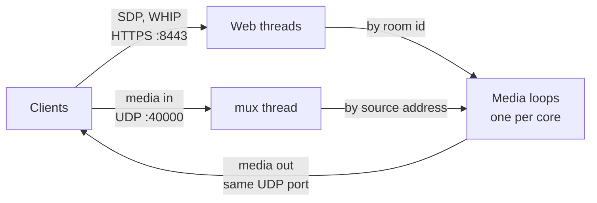

# Stream

English | [한국어](README.ko.md)

A WebRTC SFU for live streaming, written in Rust on [str0m](https://github.com/algesten/str0m). Publishers push over WHIP, from OBS or a browser. Viewers get the simulcast layer their bandwidth estimate allows, and viewers with upload to spare relay the stream to each other over a peer link, taking load off the server.

<!-- demo GIF -->

## Measured

One machine, over loopback, with the load generator on the same machine (AMD Ryzen 7 8845HS, 16 threads). The publisher sends three simulcast layers.

| | |
| --- | --- |
| One media loop | saturates at about 400 viewers, on one core |
| Four media loops | 1600 viewers across 4 rooms, no packet loss |
| P2P relay | 46 to 50 percent of media bytes carried by viewers. One relay feeds one viewer, so half is the ceiling |

Each run, and what it ruled out, is recorded in [docs/test/baseline](docs/test/baseline/).

## Quick start

```sh
cp .env.example .env            # set API_KEY, at least 16 characters
cp config.toml.example config.toml
cargo run --release
```

Create a room:

```sh
curl -X POST http://localhost:8080/rooms -H "Authorization: Bearer <API_KEY>"
# {"room_id":"RM_0_...","stream_key":"SK_..."}
```

In OBS 30 or later, open Settings, Stream, and set Service to `WHIP`, Server to `http://localhost:8443/whip`, and Bearer Token to the `stream_key`. Start streaming. The room is now `Preview`: media arrives but nobody is served yet.

Go live:

```sh
curl -X PATCH http://localhost:8080/rooms/<room_id> \
  -H "Authorization: Bearer <API_KEY>" \
  -H "Content-Type: application/json" \
  -d '{"state":"Live"}'
```

Viewers can now join with an SDP offer to `/offer`.

<!-- viewer page -->

Everything in `config.toml` has a default, so the file is optional. `.env` holds the one secret; everything else lives in the config file.

The server tells clients to send media to the first network interface it finds. Behind NAT, set `server.public_ip` to an address clients can reach.

`docker compose up` runs the same server. Uncomment the `config.toml` volume in `compose.yaml` so the file is read, and set `server.public_ip`: inside a container the first interface is the bridge, unroutable from outside.

`[server.tls]` serves TLS on `:8443`. `:8080` is always plain HTTP and belongs on a private network. Without the section both are plain, for deployments behind a reverse proxy.

## Architecture



Signalling goes over HTTPS to the web threads, which hand each client to the media loop that owns its room. Media arrives on one UDP port, where the mux thread reads it and hands each datagram to the loop that owns its source address. Each loop owns its rooms outright on a thread of its own, and sends on the same port, so clients see a single address.

[docs/architecture](docs/architecture/overview.md) has the full flow.

## Authentication

Two credentials, on separate ports.

| Credential | Header | Used by | Scope |
| --- | --- | --- | --- |
| Server API key | `Authorization: Bearer <API_KEY>` | your backend | every control route |
| Stream key | `Authorization: Bearer <SK_...>` | publishers | one room |

The server API key comes from the environment and must never reach a browser. A stream key is issued per room, returned once, and stored only as a hash. It both authorizes publishing and selects the room, so no room id appears in publish URLs. See [ADR 0010](docs/decisions/0010-stream-key-authentication.md).

## Control API

HTTP `:8080`, for your backend. Every route requires the server API key.

| Method | Path | Description |
| --- | --- | --- |
| `POST` | `/rooms` | Create a room. Returns `room_id` and `stream_key` |
| `GET` | `/rooms/{id}` | Viewer count and room state |
| `PATCH` | `/rooms/{id}` | Set room state. `Idle` also ends the broadcast |
| `DELETE` | `/rooms/{id}` | Delete the room and its stream key |
| `POST` | `/rooms/{id}/stream-key` | Reissue, retiring the previous key |
| `GET` | `/metrics` | Counters and timings for the media loops, cumulative since start |

## Client API

HTTPS `:8443`, called by clients directly.

| Method | Path | Auth | Description |
| --- | --- | --- | --- |
| `POST` | `/offer` | none | Viewer joins. SDP offer in, SDP answer out |
| `POST` | `/whip` | stream key | Publish. `application/sdp` in and out |
| `DELETE` | `/whip/sessions/{id}` | stream key | End the publishing session |

`/whip` works from OBS and from a browser alike.

## Room State

```
Idle  ──►  Preview  ──►  Live  ──┐
 ▲          publisher   control  │
 └─────────────────────────────◄─┘
```

A room starts `Idle`. A publisher passing stream key auth moves it to `Preview`, where media arrives but is not served. The control plane promotes `Preview` to `Live`, so connecting an encoder never publishes to viewers on its own. Ending the stream evicts everyone and returns the room to `Idle`, keeping its stream key.

A viewer calling `/offer` on an `Idle` or `Preview` room gets `404`. See [ADR 0011](docs/decisions/0011-room-lifecycle-and-go-live.md).

## P2P Relay

To reduce SFU bandwidth, stable viewers are promoted to relay nodes.

```
Default:  SFU ──► Client A
          SFU ──► Client B

Relay:    SFU ──► Client A (relay) ──► Client B
```

Promotion needs a healthy perf window, a passing upload probe, and a minimum connection age. A relay reports its real outbound rate and is demoted when it cannot sustain the load, returning its leaf to direct forwarding. Thresholds live in `config.toml`. See [ADR 0009](docs/decisions/0009-auto-promote-demote-policy.md) and [feature/p2p-relay.md](docs/feature/p2p-relay.md).

## Testing

```sh
cargo test                                                    # unit and integration
cargo test --release --test load -- --ignored --nocapture     # load run
```

The integration suites start the real server and drive it over HTTP and UDP with str0m clients, including a publisher that sends simulcast RTP. [docs/test](docs/test/README.md) covers the suites, the load run and how to read it.

## Limits

- No TURN. A client that cannot reach UDP `:40000` directly cannot connect.
- A room lives on one media loop, so one room is bounded by one core. [#73](https://github.com/kimsun721/stream/issues/73) lets a room span loops.
- Rooms and stream keys live in memory. A restart drops them.
- An HTTP handler holds a tokio worker while it waits for a media loop to answer. See [ADR 0007](docs/decisions/0007-defer-sync-mpsc-recv-blocking.md).
- One process. Nothing spreads load across servers.

## Docs

- [Decisions](docs/decisions/): ADRs recording why the design is what it is
- [Architecture](docs/architecture/overview.md): components, threads and data flow
- [Features](docs/feature/): design docs for simulcast and the P2P relay
- [Tests](docs/test/README.md): suites, the load run, and recorded baselines

## Roadmap

- [x] Simulcast with manual layer selection
- [x] P2P relay
- [x] Simulcast layers switched by bandwidth estimate
- [x] WHIP, for OBS
- [x] Integration tests and a load baseline
- [x] Rooms spread across media loops
- [ ] Place clients rather than rooms, so one room can span loops
- [ ] Persist rooms and stream keys across restarts
- [ ] WHEP for viewers
- [ ] TURN, for clients and relay pairs that cannot reach each other directly
